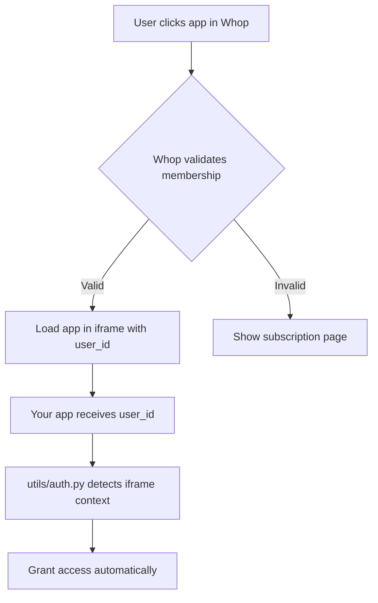

# 🎯 Whop Iframe Embed Setup Guide

This guide will help you embed your Streamlit Pivot Analysis app inside Whop as a Consumer App.

---

## 📋 Overview

Your app will appear **inside the Whop dashboard** as a native experience, accessible alongside chat, forums, and courses. Users never leave Whop!

```
User Flow:
User → Whop Dashboard → Your App Tab (iframe) → Full App Experience
```

---

## 🚀 Quick Start (3 Steps)

### **Step 1: Deploy Your Streamlit App**

First, you need to host your app publicly. Choose one option:

#### **Option A: Streamlit Community Cloud (Free, Easiest)**

1. Push your code to GitHub (private or public repo)
2. Go to [share.streamlit.io](https://share.streamlit.io)
3. Sign in with GitHub
4. Click "New app"
5. Select your repo and `app.py`
6. Add your secrets (from `.env`):
   ```
   SUPABASE_URL = "https://nrkcllajoewsqzkpoiov.supabase.co"
   SUPABASE_SERVICE_KEY = "your-service-key"
   WHOP_API_KEY = "s6uH7Ai74uhvQ8RgLknX7m2EbVA7K4ntzxZiFjfSOs8"
   WHOP_APP_ID = "app_DJhUuup8LkNM5l"
   WHOP_AGENT_USER_ID = "user_pOWW7RpY6aqmP"
   WHOP_COMPANY_ID = "biz_knsV903sM2sJ3d"
   DEV_MODE = "False"
   ```
7. Click "Deploy"
8. Copy your app URL (e.g., `https://your-app.streamlit.app`)

#### **Option B: Railway (Paid, Better Performance)**

1. Go to [railway.app](https://railway.app)
2. Connect your GitHub repo
3. Railway will auto-detect Streamlit
4. Add environment variables from your `.env`
5. Deploy and copy your URL

---

### **Step 2: Configure Your Whop App**

1. **Go to Whop Developer Dashboard:**
   - Visit [whop.com/apps](https://whop.com/apps)
   - Find your app or create a new one

2. **Set App Type to "Consumer App":**
   - Click on your app
   - Go to "App Settings"
   - Set **App Type** to **"Consumer App"**

3. **Enable Iframe Embedding:**
   - In App Settings, find **"Iframe Settings"**
   - Enable **"Allow iframe embedding"**
   - Add your Streamlit app URL to **"Allowed Origins"**

4. **Configure App View:**
   - Go to **"Views"** tab
   - Click **"Add View"**
   - Set:
     - **Name**: "Pivot Analysis" (or any name)
     - **Type**: "Iframe"
     - **URL**: `https://your-app.streamlit.app?whop_iframe=true`
     - **Icon**: 📈 (optional)
   - Save

5. **Set Permissions:**
   - Go to **"Permissions"** tab
   - Enable:
     - ✅ **Read user data**
     - ✅ **Read memberships**
   - Save

---

### **Step 3: Test Your Integration**

1. **Install on Your Test Company:**
   - In Whop Developer Dashboard, click **"Install"**
   - Choose your test company/whop
   - Authorize the app

2. **Access Your App:**
   - Go to your Whop dashboard
   - Find "Pivot Analysis" in the sidebar
   - Click it → Your app loads in an iframe!

3. **Verify:**
   - Check that sidebar shows "✅ Running inside Whop"
   - Try navigating between pages
   - Confirm data loads from Supabase

---

## 🔧 How It Works

### **Authentication Flow**



### **Key Code Changes**

Your `utils/auth.py` now:
1. **Detects iframe context** via `experience_id` or `whop_iframe=true` parameter
2. **Trusts Whop's gating** - if user is in iframe, they have access
3. **Shows "Running inside Whop"** indicator in sidebar

### **URL Parameters**

When Whop loads your app, it passes:
- `experience_id` - Unique ID for this app instance
- `user_id` - Current Whop user ID
- `whop_iframe=true` - Flag indicating iframe context

---

## 🎨 Customization

### **Optimize for Iframe**

Add this to `app.py` for better iframe experience:

```python
# Detect iframe mode
if st.query_params.get('whop_iframe') == 'true':
    # Hide Streamlit branding
    st.markdown("""
        <style>
            #MainMenu {visibility: hidden;}
            footer {visibility: hidden;}
            header {visibility: hidden;}
        </style>
    """, unsafe_allow_html=True)
```

### **Multiple Experiences**

You can create multiple app views for different use cases:
- **View 1**: "Daily Analysis" → `?timeframe=daily`
- **View 2**: "Weekly Analysis" → `?timeframe=weekly`

Each appears as a separate item in Whop sidebar.

---

## 📊 Distribution

### **Publish to Whop Marketplace**

Once tested, list your app publicly:

1. **Go to Developer Dashboard** → Your App
2. Click **"Publish"**
3. Fill out:
   - **Description**: What your app does
   - **Screenshots**: Show pivot tables, charts
   - **Pricing**: Set your monthly price
   - **Categories**: Trading, Analytics
4. Submit for review

### **Marketing**

Whop will:
- ✅ List your app in marketplace
- ✅ Handle payments automatically
- ✅ Bring you customers (200k+ active users)

You focus on:
- 🎯 Building great features
- 🎨 Creating demo videos
- 📣 Promoting on Twitter/Discord

---

## 🔒 Security

### **Iframe Security**

Your app is secure because:
1. **Whop validates membership** before loading iframe
2. **Only paying members** can access the iframe URL
3. **Your app trusts Whop's gating** (no additional API calls needed)

### **External Access**

Users can still access your app directly at `your-app.streamlit.app`, but:
- They need to enter their Whop user ID
- Your app validates membership via Whop API
- Without valid membership, they see subscription page

---

## 🐛 Troubleshooting

### **Problem: "Running inside Whop" not showing**

**Solution:** Ensure URL has `?whop_iframe=true` parameter in Whop App View settings.

### **Problem: App keeps asking for authentication**

**Solution:** 
1. Verify `DEV_MODE=False` in Streamlit Cloud secrets
2. Check that Whop passes `user_id` parameter
3. Enable browser console and check for errors

### **Problem: Blank iframe**

**Solution:**
1. Check if your app URL is accessible publicly
2. Verify "Allowed Origins" includes your Whop company URL
3. Check Streamlit Cloud deployment logs

### **Problem: Sidebar too wide in iframe**

**Solution:** Add this CSS to your app:

```python
st.markdown("""
    <style>
        section[data-testid="stSidebar"] {
            width: 250px !important;
        }
    </style>
""", unsafe_allow_html=True)
```

---

## 🚀 Next Steps

1. ✅ Deploy app to Streamlit Cloud
2. ✅ Configure Whop App as Consumer App
3. ✅ Create iframe view with your URL
4. ✅ Test installation on your company
5. ✅ Publish to marketplace
6. 🎉 Start getting customers!

---

## 📚 Additional Resources

- [Whop Apps Documentation](https://docs.whop.com/apps/introduction)
- [Whop Iframe SDK Docs](https://docs.whop.com/apps/iframe-sdk)
- [Streamlit Cloud Docs](https://docs.streamlit.io/streamlit-community-cloud)
- [Railway Deployment Guide](https://docs.railway.app)

---

## 💡 Tips for Success

1. **Keep it fast**: Users expect <3s load times
2. **Mobile-friendly**: Test on mobile browsers
3. **Clear onboarding**: Add a welcome message for new users
4. **Regular updates**: Ship new features weekly
5. **Support**: Respond quickly in Whop forums

---

## 🎯 Example App URLs

**Development:**
```
http://localhost:8502?whop_iframe=true&experience_id=test
```

**Production:**
```
https://your-app.streamlit.app?whop_iframe=true&experience_id=exp_xxxxx&user_id=user_xxxxx
```

---

Need help? Check the [Whop Discord](https://discord.gg/whop) or [Streamlit Forum](https://discuss.streamlit.io)!

